# 🍋 Little Lemon Django RESTful API
**Meta Back-End Developer Professional Certificate: Capstone Project**

## 📖 Description
A fully functional RESTful API built with Django and Django REST Framework for the fictional Little Lemon restaurant. The system supports three user roles — **Managers**, **Customers**, and **Delivery Crew** — and implements user registration, token authentication, role assignment, menu management, cart workflows, order processing, delivery assignment, filtering, pagination, search, and API throttling.

This API serves as the engine for Little Lemon’s digital ecosystem, handling complex workflows across all user groups. As a personal touch, the database is populated with authentic **Venezuelan cuisine**, featuring categories like Arepas, Cachapas, Patacones, Empanadas, Platos Principales (main dishes), and more.

### Course Project
This project was created as the final assessment for **Module 6: APIs** in the **Meta Back-End Developer Professional Certificate** on **Coursera**. It demonstrates practical application of authentication, permissions, serializers, viewsets, filtering, pagination, and throttling.

## 🧭 Project Overview
The API provides:

- **Token-based authentication** (Djoser)
- **Role management** (Manager, Delivery Crew, Customer)
- **CRUD operations** for menu items and categories
- **Cart system** with one active cart per customer
- **Order processing** that automatically empties the cart upon success
- **Logistics management** (Manager assignment to Delivery Crew)
- **Advanced querying:** Filtering, searching, sorting, and pagination
- **API Throttling:** Limited to 5 requests per minute for security

## 📁 Project Folder Structure

```plaintext
littlelemon-django-rest-api/
│
├── LittleLemon/               # Project configuration
│   ├── LittleLemon/
│   │   ├── settings.py
│   │   └── urls.py
│   │
│   ├── LittleLemonAPI/        # Main API Application
│   │   ├── models.py          # Database Schema
│   │   ├── serializers.py     # Data Transformation
│   │   ├── views.py           # Logic (FBV & CBV)
│   │   └── urls.py            # API Routes
│   │
│   ├── manage.py
│   ├── Pipfile
│   └── db.sqlite3
│
├── Insomnia_2024-10-18.json   # API Workspace
├── assets/                    # Screenshots
└── README.md
```

---

# **Insomnia Collection**

## 🧪 Testing with Insomnia (Recommended)
The repository includes ```Insomnia_2024-10-18.json```, which contains all API endpoints organized into functional folders:

1. **Djoser endpoints:** Signup, Login, Me, Logout
2. **User group management endpoints:** Manager and Delivery Crew assignments
3. **Category endpoints:** Full CRUD for menu categories
4. **Menu-items endpoints:** Browsing, searching, and managing dishes
5. **Cart management endpoints:** Customer-specific cart workflows
6. **Order management endpoints:** Creation, assignment, and status updates
7. **Additional endpoints:** Full user list (Manager only)

**To test:** Import the JSON file into [Insomnia](https://insomnia.rest/). Each request is pre-configured with the correct URL, headers, and body formats.

---

## 1. Djoser Endpoints

### 1.1. Create new user — POST `/api/users/`
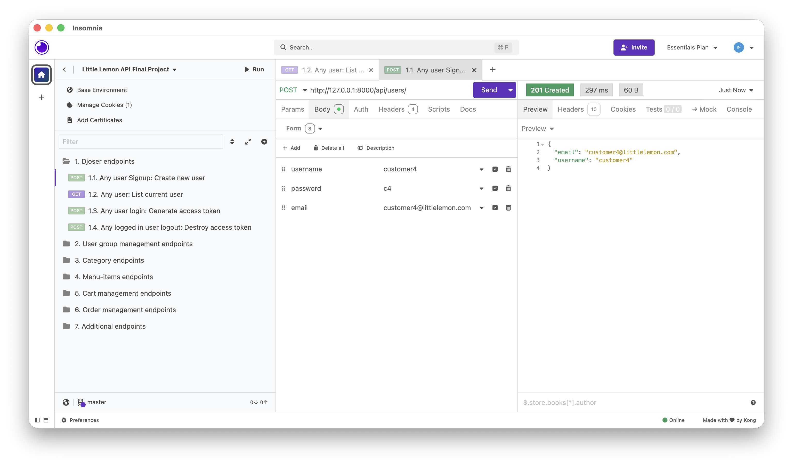

### 1.2. List current user — GET `/api/users/me/`
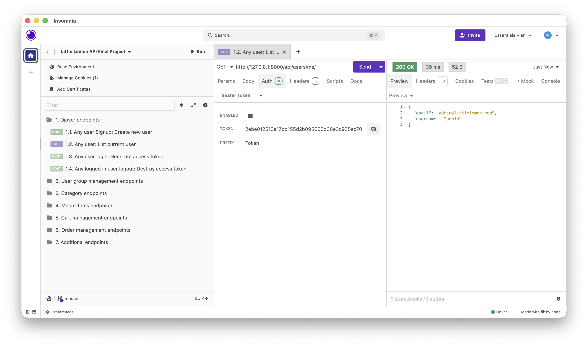

### 1.3. Generate access token — POST `/api/token/login/`
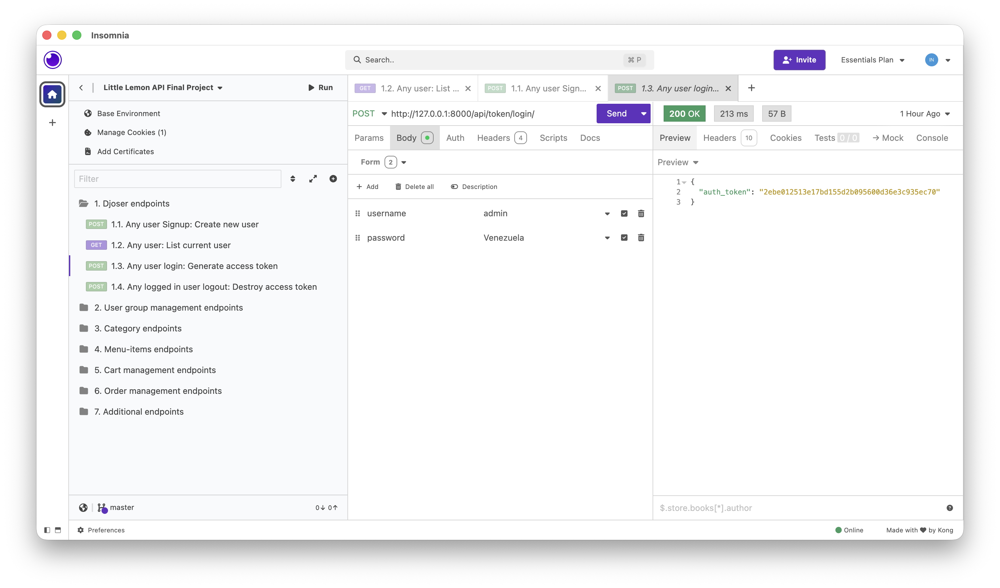

### 1.4. Logout — POST `/api/token/logout/`
(No screenshot)

---

## 2. User Group Management Endpoints

### 2.1. List all Managers — GET `/api/groups/manager/users`
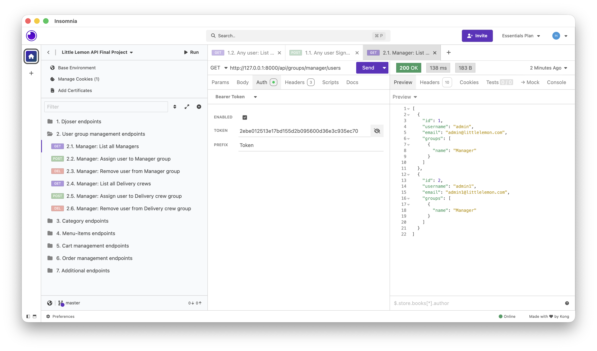

### 2.4. List all Delivery Crew — GET `/api/groups/delivery-crew/users`
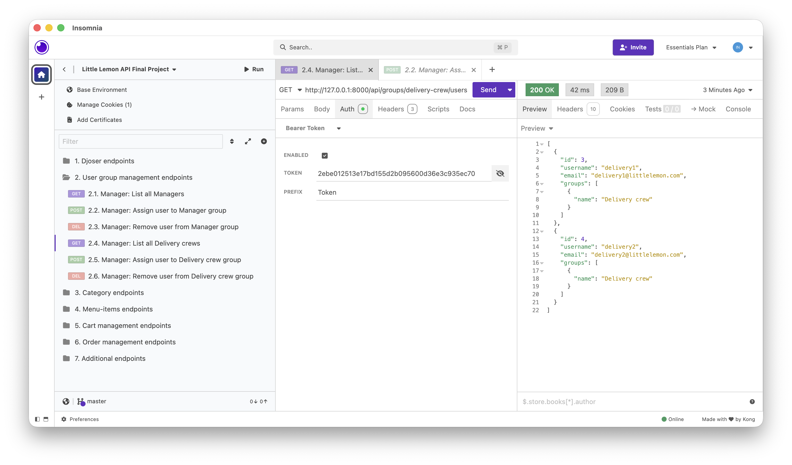

---

## 3. Category Endpoints

### 3.1. List all Categories — GET `/api/category`
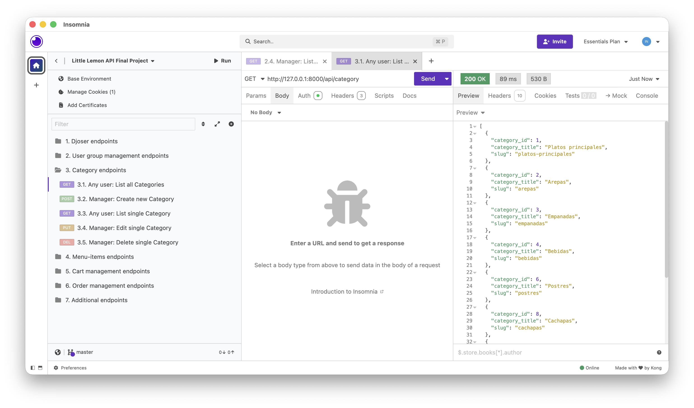

### 3.3. List single Category — GET `/api/category/{categoryId}`
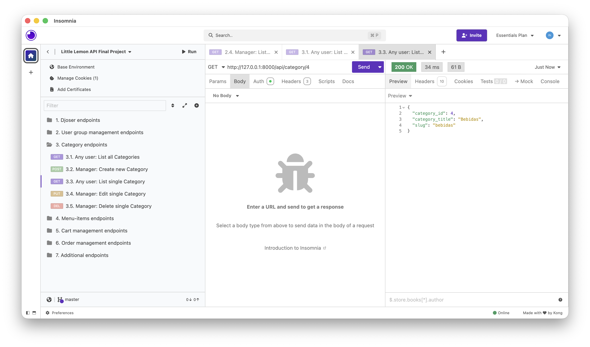

---

## 4. Menu-Items Endpoints

### 4.1. List all MenuItems — GET `/api/menu-items`
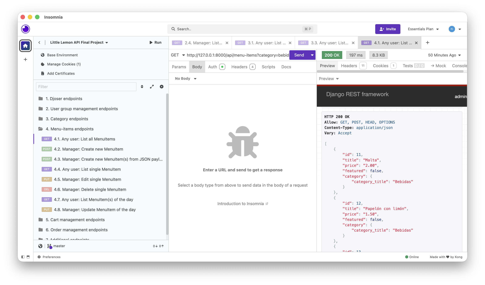

### 4.4. List single MenuItem — GET `/api/menu-items/{menuItem}`
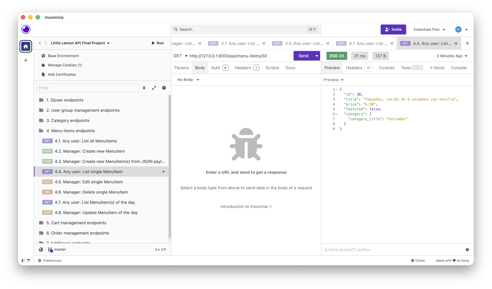

### 4.5. Edit single MenuItem — PUT `/api/menu-items/{menuItem}`
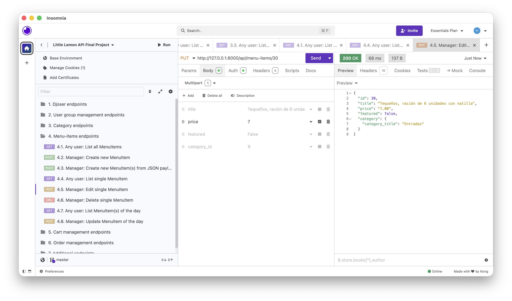

### 4.7. List MenuItem(s) of the day — GET `/api/menu-items/item-of-the-day`


---

## 5. Cart Management Endpoints
(No screenshots provided.)

---

## 6. Order Management Endpoints

### 6.3. Manager: List all Orders — GET `/api/orders`
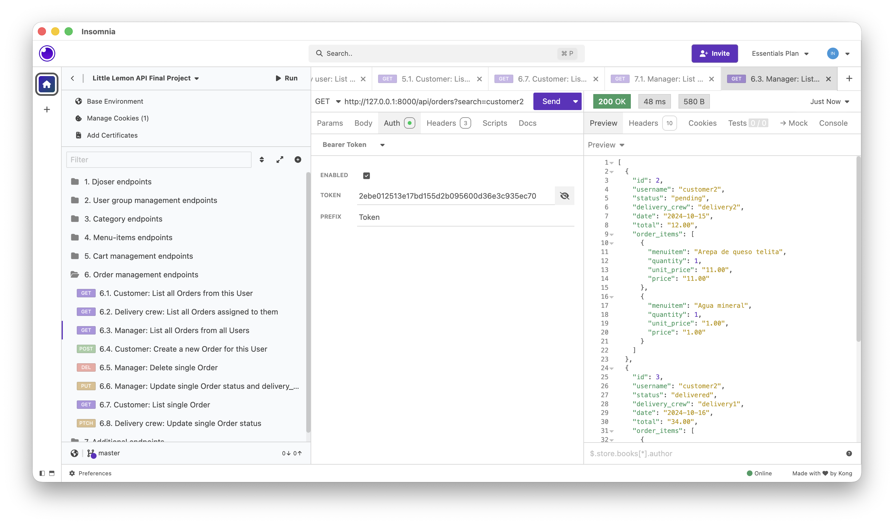

### 6.7. Customer: List single Order — GET `/api/orders/{orderId}`
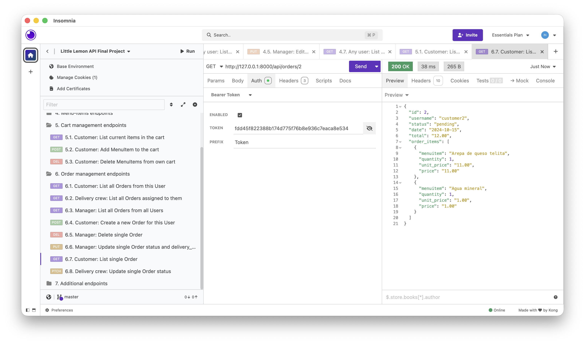

---

## 7. Additional Endpoints

### 7.1. Manager: List all users
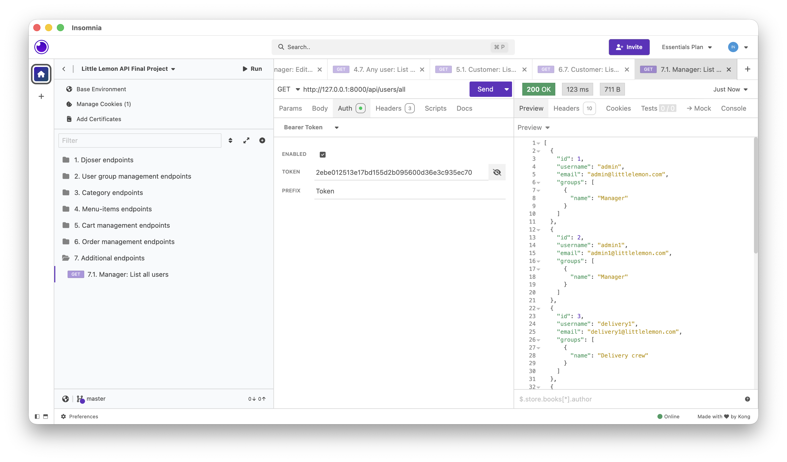

# 🔐 Authentication and Permissions

- **Token Authentication** required for protected endpoints  
- **Managers**: menu CRUD, assign roles, assign orders  
- **Delivery Crew**: view assigned orders, update status  
- **Customers**: browse menu, manage cart, place orders  

---

# 📋 HTTP Status Codes

- **200 OK** — successful GET/PUT/PATCH/DELETE  
- **201 Created** — successful POST  
- **400 Bad Request** — invalid data  
- **401 Unauthorized** — authentication required  
- **403 Forbidden** — insufficient permissions  
- **404 Not Found** — resource does not exist  

---

# ⏱️ Throttling

All authenticated and anonymous users are limited to **5 requests per minute**.

# ▶️ Setup and Run

## Install and activate virtual environment (pipenv)

```bash
if [ -d "$HOME/.local/bin" ] ; then
    PATH="$HOME/.local/bin:$PATH"
fi

pipenv shell                # Activates the Virtual Environment
pipenv install              # Installs dependencies from Pipfile
pipenv install django       # Installs Django

python manage.py migrate
python manage.py runserver
```

---

# 📬 Author
Fausto Gonzalez

